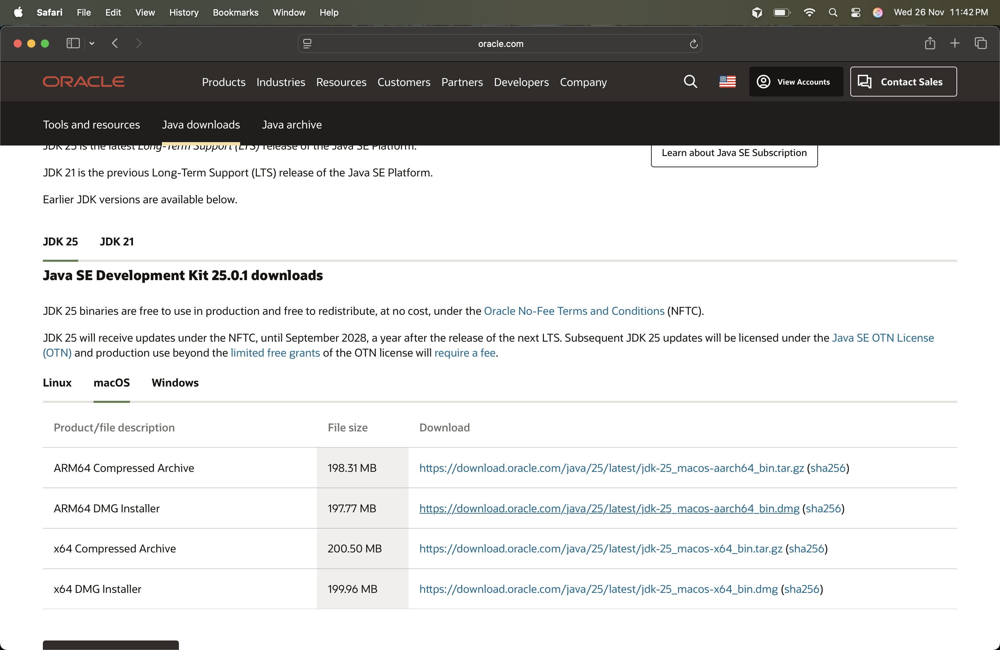
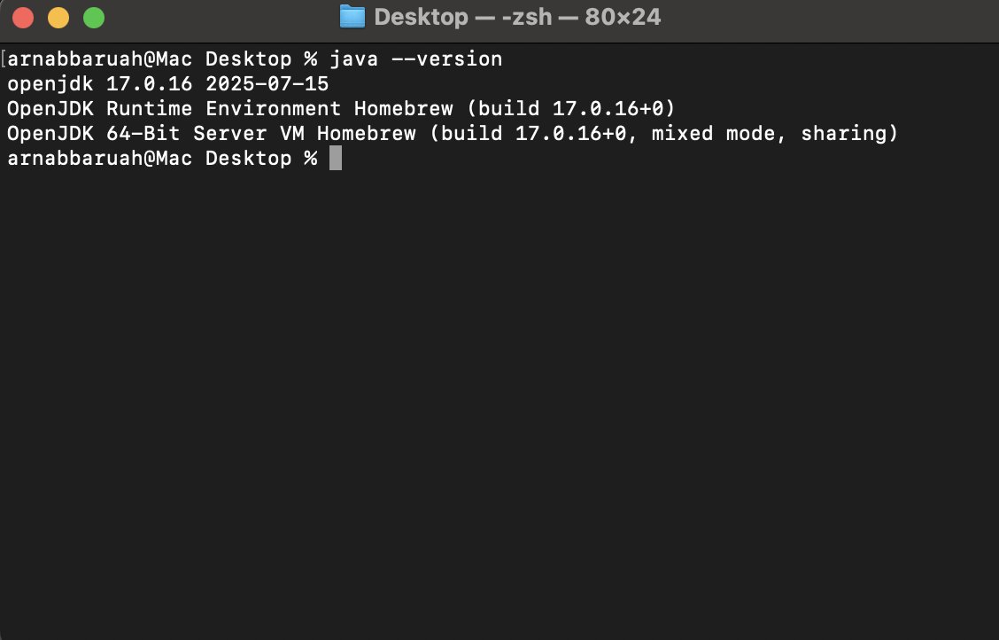

# Java JDK Installation & Configuration Guide

This document provides step-by-step instructions to install and configure **Java (JDK + JRE)** on your system.

---

## 1. Download JDK

1. Visit: https://www.oracle.com/java/technologies/downloads/
2. Choose the latest **Java SE Development Kit (JDK)**.
3. Select your OS (Windows/Mac/Linux).

### 🔽 Screenshot: JDK Download Page



---

## 2. Install the JDK

Run the installer and follow the setup wizard.

---

## 3. Verify Installation

Open Command Prompt / Terminal:

```
java -version
```

### 🔽 Screenshot: Verify Installation


